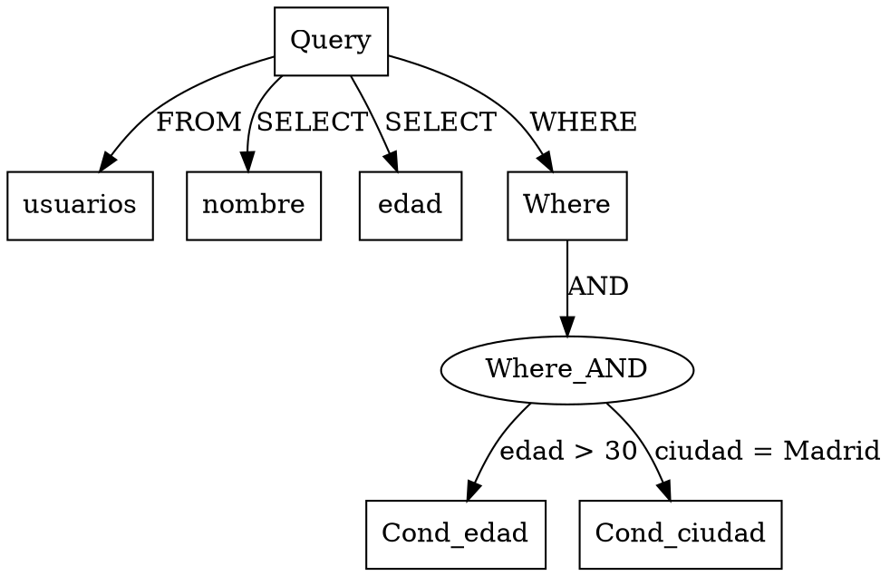

# 📌 Proyecto Final - Lenguajes de Programación  
🚀 **Analizador de un Lenguaje de Consulta Personalizado en Haskell con Parsec**  

Este proyecto implementa un **parser para consultas tipo SQL-like** usando **Haskell** y la biblioteca **Parsec**. El objetivo es procesar y estructurar consultas, generando un **Árbol de Sintaxis Abstracta (AST)** para su análisis y visualización.  

---

## 🔹 Características Principales  
✅ **Parser funcional** para consultas SQL-like con `SELECT`, `FROM` y `WHERE`.  
✅ **AST (Árbol de Sintaxis Abstracta)** para representar la estructura de la consulta.  
✅ **Soporte para operadores de comparación:** `=`, `>`, `<`, `>=`, `<=`, `!=`.  
✅ **Manejo de condiciones lógicas con `AND` y `OR` en la cláusula WHERE**.  
✅ **Generación de representación en formato DOT** para visualizar la consulta con Graphviz.  
✅ **Soporte completo para WinHugs** con ajustes en el manejo de espacios y operadores.  

---

## 📂 Estructura del Proyecto  

```
📁 ProyectoFinalLenguajesDeProgramacion  
│── 📁 images                   # Carpeta para imágenes del proyecto  
│── 📜 .gitignore                # Archivos ignorados en Git  
│── 📜 README.md                 # Documentación principal del proyecto  
│── 📜 analizador.hs              # Implementación del parser en Haskell  
│── 📜 tests.hs                   # Pruebas unitarias  
│── 📜 presentacion.pptx          # Presentación del proyecto  
│── 📜 Proyecto_Final_Lenguajes.pdf # Documento técnico en PDF  
```

---

## 🛠 Instalación y Configuración  

### **🔹 Requisitos Previos**  
Para ejecutar el parser, necesitas:  
- **WinHugs (Intérprete de Haskell para Windows)**  
- **Graphviz** (opcional, para visualizar la representación DOT)  

### **🔹 Clonar el Repositorio**
```bash
git clone https://github.com/tu-usuario/ProyectoFinalLenguajesDeProgramacion.git
cd ProyectoFinalLenguajesDeProgramacion
```

### **🔹 Ejecutar el Parser en Hugs**  
Para probar el parser en **WinHugs**, usa:  
```haskell
:load analizador.hs
main
```

---

## 🎯 Ejemplo de Uso  

**Consulta SQL-like de prueba:**  
```sql
SELECT nombre, edad FROM usuarios WHERE edad > 30 AND ciudad = Madrid
```
**Salida esperada en AST:**  
```haskell
Query { selectFields = ["nombre","edad"],
        fromTable = "usuarios",
        whereClause = Just (And 
            (Cond Condition {column = "edad", operator = Gt, value = "30"})
            (Cond Condition {column = "ciudad", operator = Eq, value = "Madrid"})
        )}
```
**Salida en formato DOT (para Graphviz):**  

Para visualizarlo con Graphviz:
```bash
dot -Tpng output.dot -o output.png
```

---

## 🛠 Mejoras Implementadas  
🔹 **Optimización del parser**: Manejo mejorado de espacios en blanco y estructura modular.  
🔹 **Corrección de precedencia en `AND` y `OR`**: Ahora respeta la jerarquía correcta.  
🔹 **Soporte para nombres de tablas y columnas con `_` y números**.  
🔹 **Manejo de errores detallado** con mensajes más descriptivos.  

---

## 🚀 Próximos Pasos y Mejoras Futuras  
- **Añadir soporte para valores de texto entre comillas en `WHERE`**.  
- **Implementar operadores avanzados** (`LIKE`, `IN`, `BETWEEN`).  
- **Soporte para `ORDER BY`, `GROUP BY`, `LIMIT`**.  
- **Interfaz gráfica o API REST** para interactuar con el parser.  

---

## 🤝 Contribuciones  
¡Las contribuciones son bienvenidas! Si deseas mejorar el proyecto, puedes hacer un fork y enviar un pull request.  

📌 **Autores:**  
👨‍💻 **Anderson Stick Barrera Tovar**  
👨‍💻 **Santiago García Rodríguez**  
👨‍💻 **Carlos Daniel García Chaparro**  
👨‍💻 **Manuel Nicolás Castiblanco Avendaño**  
👩‍💻 **Maria Paula Carvajal Martínez**  

📅 **Fecha:** **Marzo 2025**  
📚 **Materia:** *Lenguajes de Programación*  
👨‍🏫 **Profesor:** *Jorge Alfonso Melendez Acuña*  

---

## 📜 Licencia  
Este proyecto está bajo la licencia MIT. Puedes utilizarlo y modificarlo libremente.  
```